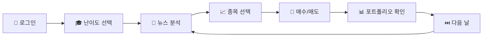
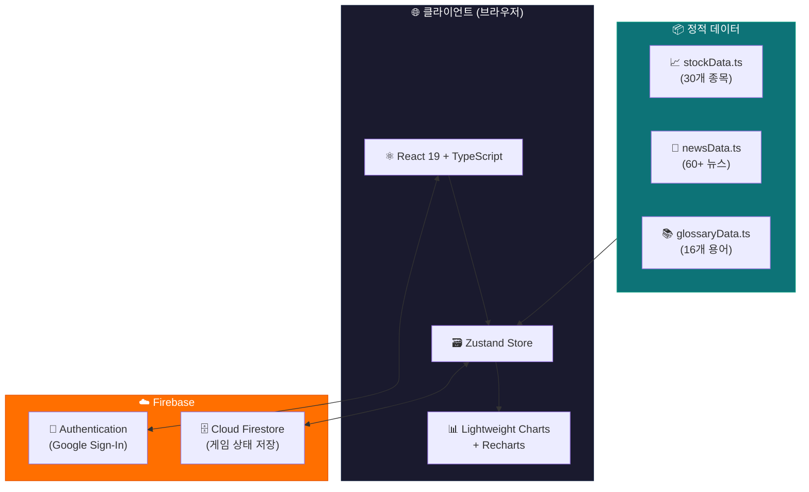
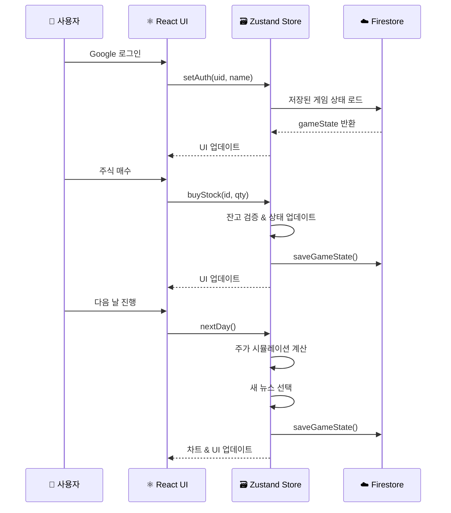

<div align="center">

# 📈 스탁스쿨 (StockSchool)

### 실전 금융투자 교육 시뮬레이터

<p align="center">
  <strong>학생들을 위한 게임형 모의 주식 투자 플랫폼</strong><br/>
  뉴스를 분석하고, 주식을 사고팔며, 투자의 세계를 안전하게 경험하세요!
</p>

<p align="center">
  
  
  
  
  
</p>

<p align="center">
  
  
  
  
</p>

---

[📋 소개](#-프로젝트-소개) •
[✨ 기능](#-주요-기능) •
[🏗️ 기술 스택](#️-기술-스택) •
[🚀 시작하기](#-시작하기) •
[🎮 게임 가이드](#-게임-플레이-가이드) •
[📊 아키텍처](#-시스템-아키텍처) •
[📖 문서](#-문서) •
[🤝 기여하기](#-기여하기)

</div>

---

## 📋 프로젝트 소개

**스탁스쿨(StockSchool)** 은 초등학생부터 고등학생까지, 실제 한국 기업의 주식을 기반으로 투자를 배울 수 있는 **게임형 금융 교육 시뮬레이터**입니다.

> 💡 *"실제 돈 없이, 실전처럼 배우는 주식 투자 교실"*

학생들은 매일 뉴스를 분석하고, 삼성전자·현대차·네이버 등 실제 한국 기업의 모의 주식을 사고팔며, 포트폴리오를 관리하는 과정에서 **자연스럽게 금융 리터러시**를 키울 수 있습니다.

### 🎯 왜 스탁스쿨인가?

| 특징 | 설명 |
|:---:|:---|
| 🎓 **난이도 맞춤** | 초등·중등·고등 3단계 난이도로 눈높이에 맞는 학습 |
| 🏢 **실제 기업** | 삼성전자, SK하이닉스 등 30개 한국 대표 기업 |
| 📰 **뉴스 시뮬레이션** | 실전과 같은 뉴스 → 주가 연동 시스템 |
| 📊 **전문가 차트** | TradingView 기반 실시간 가격 차트 |
| 📚 **금융 용어 사전** | 16개 핵심 금융 용어를 난이도별로 해설 |
| 🌙 **다크 모드** | 눈이 편한 다크/라이트 테마 지원 |

---

## ✨ 주요 기능

### 🏫 3단계 난이도 시스템

```
🟢 초등학생 (Elementary)    → 초기 자금 100만원  | 쉬운 뉴스 & 용어 설명
🟡 중학생   (Middle School) → 초기 자금 500만원  | 중급 산업 분석
🔴 고등학생 (High School)   → 초기 자금 1,000만원 | 전문 밸류에이션 용어
```

### 📈 핵심 기능 목록

- 🔐 **Google 소셜 로그인** — Firebase Authentication 기반 안전한 인증
- 💹 **실시간 주가 시뮬레이션** — 뉴스·시장요인·변동성·평균회귀·충격이벤트 반영
- 🛒 **매수/매도 거래** — 평균 매수가 자동 계산, 수량 조절, 잔고 검증
- 📊 **포트폴리오 관리** — 보유 종목, 수익률, 자산 추이 차트, 섹터 비중 파이차트
- 📰 **뉴스 분석 시스템** — 매일 3개 뉴스 제공, 다음 날 AI 해설 공개
- 📖 **금융 용어 사전** — 주식, PER, ROE 등 16개 핵심 용어 난이도별 설명
- 📋 **호가창 시뮬레이션** — 실제 HTS와 유사한 매수/매도 호가 표시
- 🏢 **기업 정보 패널** — 기업별 난이도 맞춤 분석 리포트
- 🎓 **인터랙티브 튜토리얼** — 8단계 온보딩으로 초보자도 쉽게 시작
- 💾 **클라우드 저장** — Firebase Firestore로 게임 진행 상태 자동 저장
- 🌗 **다크/라이트 테마** — 한 번의 클릭으로 테마 전환

---

## 🏗️ 기술 스택

<table>
<tr>
<td align="center" width="25%">

**🎨 프론트엔드**

</td>
<td align="center" width="25%">

**🗄️ 백엔드 서비스**

</td>
<td align="center" width="25%">

**📊 차트 & UI**

</td>
<td align="center" width="25%">

**🔧 개발 도구**

</td>
</tr>
<tr>
<td>


</td>
<td>


</td>
<td>


</td>
<td>


</td>
</tr>
</table>

---

## 📁 프로젝트 구조

```
📦 모의주식/
├── 📄 index.html                    # HTML 진입점
├── 📄 package.json                  # 프로젝트 설정 & 의존성
├── 📄 vite.config.ts                # Vite 빌드 설정
├── 📄 tailwind.config.js            # TailwindCSS 설정
├── 📄 tsconfig.json                 # TypeScript 설정
├── 📄 .gitignore                    # Git 제외 파일
│
├── 📂 public/                       # 정적 파일
│   ├── 🎨 favicon.svg               # 파비콘
│   └── 🎨 icons.svg                 # SVG 아이콘 스프라이트
│
├── 📂 src/                          # 소스 코드
│   ├── 📄 main.tsx                  # React 진입점
│   ├── 📄 App.tsx                   # 루트 컴포넌트 (인증 & 라우팅)
│   ├── 🎨 App.css                   # 앱 전역 스타일
│   ├── 🎨 index.css                 # CSS 변수 & 기본 스타일
│   │
│   ├── 📂 assets/                   # 이미지 & 미디어 자산
│   │
│   ├── 📂 components/               # React 컴포넌트
│   │   ├── 📂 layout/               # 레이아웃 컴포넌트
│   │   │   ├── AppShell.tsx         #   메인 앱 레이아웃
│   │   │   ├── Header.tsx           #   상단 헤더 바
│   │   │   └── SchoolLogo.tsx       #   학교 로고 SVG
│   │   │
│   │   ├── 📂 trading/              # 트레이딩 컴포넌트
│   │   │   ├── StockList.tsx        #   종목 리스트 (검색/필터)
│   │   │   ├── PriceChart.tsx       #   가격 차트 (TradingView)
│   │   │   ├── OrderPanel.tsx       #   매수/매도 주문 패널
│   │   │   ├── OrderBook.tsx        #   호가창
│   │   │   ├── PortfolioPanel.tsx   #   포트폴리오 대시보드
│   │   │   ├── NewsPanel.tsx        #   뉴스 패널
│   │   │   ├── CompanyInfoPanel.tsx #   기업 정보 패널
│   │   │   ├── GlossaryHub.tsx      #   금융 용어 사전
│   │   │   └── TutorialGuide.tsx    #   튜토리얼 가이드
│   │   │
│   │   └── 📂 ui/                   # 기초 UI 컴포넌트 (shadcn/ui)
│   │       ├── button.tsx, card.tsx, dialog.tsx, input.tsx,
│   │       ├── label.tsx, scroll-area.tsx, sheet.tsx,
│   │       ├── sonner.tsx, table.tsx, tabs.tsx
│   │
│   ├── 📂 lib/                      # 유틸리티 & 데이터
│   │   ├── firebase.ts              #   Firebase 초기화
│   │   ├── stockData.ts             #   30개 종목 데이터 (55KB)
│   │   ├── newsData.ts              #   60+ 뉴스 이벤트 (147KB)
│   │   ├── glossaryData.ts          #   16개 금융 용어 (25KB)
│   │   └── utils.ts                 #   유틸리티 함수
│   │
│   ├── 📂 pages/                    # 페이지 컴포넌트
│   │   ├── Login.tsx                #   로그인 & 난이도 선택
│   │   └── Dashboard.tsx            #   메인 대시보드
│   │
│   └── 📂 stores/                   # 상태 관리
│       └── gameStore.ts             #   Zustand 게임 스토어
│
└── 📂 docs/                         # 프로젝트 문서
    ├── ARCHITECTURE.md              #   시스템 아키텍처
    ├── TECH_STACK.md                #   기술 스택 상세
    ├── COMPONENT_GUIDE.md           #   컴포넌트 가이드
    ├── GAME_MECHANICS.md            #   게임 메카닉스
    ├── DATA_MODELS.md               #   데이터 모델
    ├── API_REFERENCE.md             #   API 레퍼런스
    ├── DESIGN_SYSTEM.md             #   디자인 시스템
    ├── SETUP_GUIDE.md               #   설치 가이드
    ├── DEPLOYMENT.md                #   배포 가이드
    ├── CONTRIBUTING.md              #   기여 가이드
    ├── CODE_OF_CONDUCT.md           #   행동 강령
    ├── SECURITY.md                  #   보안 정책
    ├── CHANGELOG.md                 #   변경 이력
    └── ROADMAP.md                   #   로드맵
```

---

## 🚀 시작하기

### 📋 사전 요구사항

| 도구 | 최소 버전 | 권장 버전 |
|:---:|:---:|:---:|
| Node.js | 18.0+ | 20 LTS |
| npm | 9.0+ | 10+ |
| Git | 2.30+ | 최신 |

### ⚡ 빠른 시작

```bash
# 1. 저장소 클론
git clone https://github.com/your-username/stock-school.git
cd stock-school

# 2. 의존성 설치
npm install

# 3. 개발 서버 실행
npm run dev
```

> 🌐 브라우저에서 `http://localhost:5173` 접속

### 🔥 Firebase 설정

Firebase 프로젝트를 직접 구성하려면 [📖 Setup Guide](./docs/SETUP_GUIDE.md)를 참조하세요.

```typescript
// src/lib/firebase.ts 에 Firebase 설정값 입력
const firebaseConfig = {
  apiKey: "YOUR_API_KEY",
  authDomain: "YOUR_PROJECT.firebaseapp.com",
  projectId: "YOUR_PROJECT_ID",
  storageBucket: "YOUR_PROJECT.firebasestorage.app",
  messagingSenderId: "YOUR_SENDER_ID",
  appId: "YOUR_APP_ID"
};
```

### 📦 사용 가능한 스크립트

| 명령어 | 설명 |
|:---|:---|
| `npm run dev` | 개발 서버 실행 (HMR 지원) |
| `npm run build` | 프로덕션 빌드 |
| `npm run preview` | 빌드 결과물 미리보기 |
| `npm run lint` | ESLint 코드 검사 |

---

## 🎮 게임 플레이 가이드

### 🕹️ 플레이 흐름



### 📖 단계별 설명

| 단계 | 액션 | 설명 |
|:---:|:---:|:---|
| 1️⃣ | **로그인** | Google 계정으로 안전하게 로그인 |
| 2️⃣ | **난이도 선택** | 초등/중등/고등 중 나에게 맞는 레벨 선택 |
| 3️⃣ | **뉴스 읽기** | 오늘의 뉴스 3개를 읽고 시장에 미칠 영향 분석 |
| 4️⃣ | **종목 탐색** | 30개 종목 중 투자할 기업 선택, 차트 분석 |
| 5️⃣ | **거래 실행** | 매수 또는 매도 주문 실행 |
| 6️⃣ | **포트폴리오** | 보유 종목 확인, 수익률 체크 |
| 7️⃣ | **다음 날** | 다음 날로 진행 → 주가 변동 & 새 뉴스 |

### 🏢 거래 가능 종목 (30개)

<details>
<summary>📋 전체 종목 목록 보기</summary>

| 섹터 | 종목 | 기준가 | 변동성 |
|:---|:---|---:|:---:|
| 🖥️ 기술 | 삼성전자 | ₩83,000 | 0.7 |
| 🖥️ 기술 | SK하이닉스 | ₩210,000 | 1.3 |
| 🚗 자동차 | 현대차 | ₩280,000 | 0.9 |
| 🚗 자동차 | 기아 | ₩135,000 | 1.0 |
| 🔋 에너지 | LG에너지솔루션 | ₩380,000 | 1.4 |
| 🌐 인터넷 | 네이버 | ₩220,000 | 1.1 |
| 🌐 인터넷 | 카카오 | ₩55,000 | 1.3 |
| 🏦 금융 | KB금융 | ₩85,000 | 0.6 |
| 🏦 금융 | 신한지주 | ₩45,000 | 0.7 |
| 🏦 금융 | 삼성생명 | ₩90,000 | 0.5 |
| 🧬 바이오 | 삼성바이오로직스 | ₩880,000 | 1.0 |
| 🧬 바이오 | 셀트리온 | ₩190,000 | 1.2 |
| 🛡️ 방산 | 한화에어로스페이스 | ₩260,000 | 1.4 |
| 🍜 식품 | 삼양식품 | ₩650,000 | 1.6 |
| ⚗️ 화학 | LG화학 | ₩450,000 | 1.1 |
| ⚗️ 화학 | 포스코퓨처엠 | ₩290,000 | 1.6 |
| 🏗️ 소재 | POSCO홀딩스 | ₩400,000 | 1.5 |
| 🔋 에너지 | 삼성SDI | ₩420,000 | 1.2 |
| 🚗 자동차 | 현대모비스 | ₩250,000 | 0.8 |
| 🔋 에너지 | S-Oil | ₩75,000 | 1.4 |
| 🔋 에너지 | SK이노베이션 | ₩120,000 | 1.5 |
| 📡 통신 | SK텔레콤 | ₩52,000 | 0.5 |
| 📡 통신 | KT | ₩38,000 | 0.6 |
| 🚢 조선 | HD현대중공업 | ₩130,000 | 1.5 |
| 🏗️ 건설 | 현대건설 | ₩40,000 | 1.2 |
| *...외 5개 종목* | | | |

</details>

---

## 📊 시스템 아키텍처



### 🔄 데이터 흐름



> 📖 더 자세한 아키텍처 문서는 [docs/ARCHITECTURE.md](./docs/ARCHITECTURE.md)를 참조하세요.

---

## 📖 문서

| 문서 | 설명 |
|:---|:---|
| 📐 [아키텍처](./docs/ARCHITECTURE.md) | 시스템 구조 & 컴포넌트 계층 |
| 🔧 [기술 스택](./docs/TECH_STACK.md) | 사용 기술 상세 & 선택 이유 |
| 🧩 [컴포넌트 가이드](./docs/COMPONENT_GUIDE.md) | UI 컴포넌트 설명서 |
| 🎲 [게임 메카닉스](./docs/GAME_MECHANICS.md) | 주가 시뮬레이션 & 게임 로직 |
| 📦 [데이터 모델](./docs/DATA_MODELS.md) | 인터페이스 & 데이터 구조 |
| 📡 [API 레퍼런스](./docs/API_REFERENCE.md) | Store & 함수 API 문서 |
| 🎨 [디자인 시스템](./docs/DESIGN_SYSTEM.md) | 컬러, 타이포, 레이아웃 |
| 📥 [설치 가이드](./docs/SETUP_GUIDE.md) | 상세 설치 & Firebase 설정 |
| 🚀 [배포 가이드](./docs/DEPLOYMENT.md) | 프로덕션 배포 방법 |
| 🤝 [기여 가이드](./docs/CONTRIBUTING.md) | 코드 기여 방법 & 컨벤션 |
| 📜 [행동 강령](./docs/CODE_OF_CONDUCT.md) | 커뮤니티 행동 규범 |
| 🔒 [보안 정책](./docs/SECURITY.md) | 보안 취약점 보고 & 정책 |
| 📝 [변경 이력](./docs/CHANGELOG.md) | 버전별 변경 기록 |
| 🗺️ [로드맵](./docs/ROADMAP.md) | 향후 개발 계획 |

---

## 🤝 기여하기

스탁스쿨의 발전에 기여해 주세요! 모든 기여를 환영합니다. 🎉

```bash
# 1. 포크 후 클론
git clone https://github.com/your-username/stock-school.git

# 2. 브랜치 생성
git checkout -b feature/amazing-feature

# 3. 변경사항 커밋
git commit -m "feat: 놀라운 새 기능 추가"

# 4. 브랜치에 푸시
git push origin feature/amazing-feature

# 5. Pull Request 생성
```

자세한 기여 방법은 [📖 CONTRIBUTING.md](./docs/CONTRIBUTING.md)를 참조하세요.

### 💡 기여 가능 영역

- 🐛 **버그 신고** — Issue 탭에서 버그를 알려주세요
- ✨ **새 기능 제안** — 아이디어를 Feature Request로 공유해 주세요
- 📈 **새 종목 추가** — 한국 상장 기업 종목을 추가해 주세요
- 📰 **뉴스 시나리오** — 새로운 뉴스 이벤트를 작성해 주세요
- 📚 **용어 추가** — 금융 용어 사전을 확장해 주세요
- 🌍 **번역** — 다국어 지원을 도와주세요
- 📖 **문서 개선** — 문서를 더 쉽고 정확하게 다듬어 주세요

---

## 📄 라이선스

이 프로젝트는 **MIT License** 하에 배포됩니다. 자세한 내용은 [LICENSE](./LICENSE) 파일을 참조하세요.

---

## 📬 문의

- 🐙 **GitHub Issues**: [이슈 탭](../../issues)에서 질문이나 제안을 남겨주세요
- 📧 **이메일**: 프로젝트 관련 문의는 이슈를 통해 접수해 주세요

---

<div align="center">

**⭐ 이 프로젝트가 마음에 드셨다면 Star를 눌러주세요! ⭐**

<br/>

Made with ❤️ for Korean Students

<sub>© 2026 StockSchool Contributors. All rights reserved.</sub>

</div>
