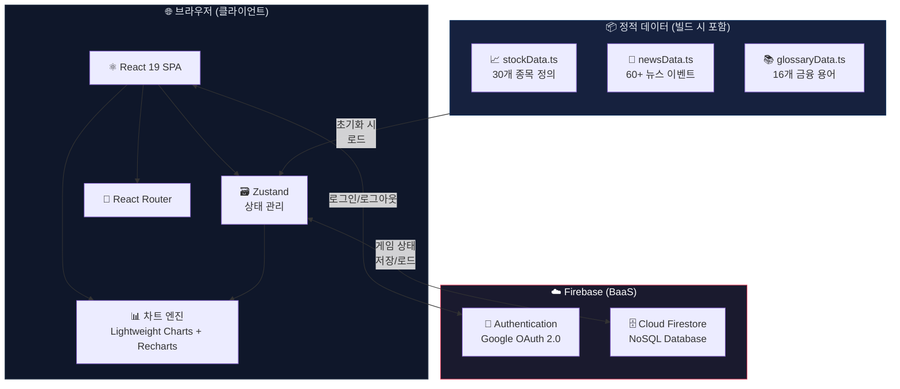
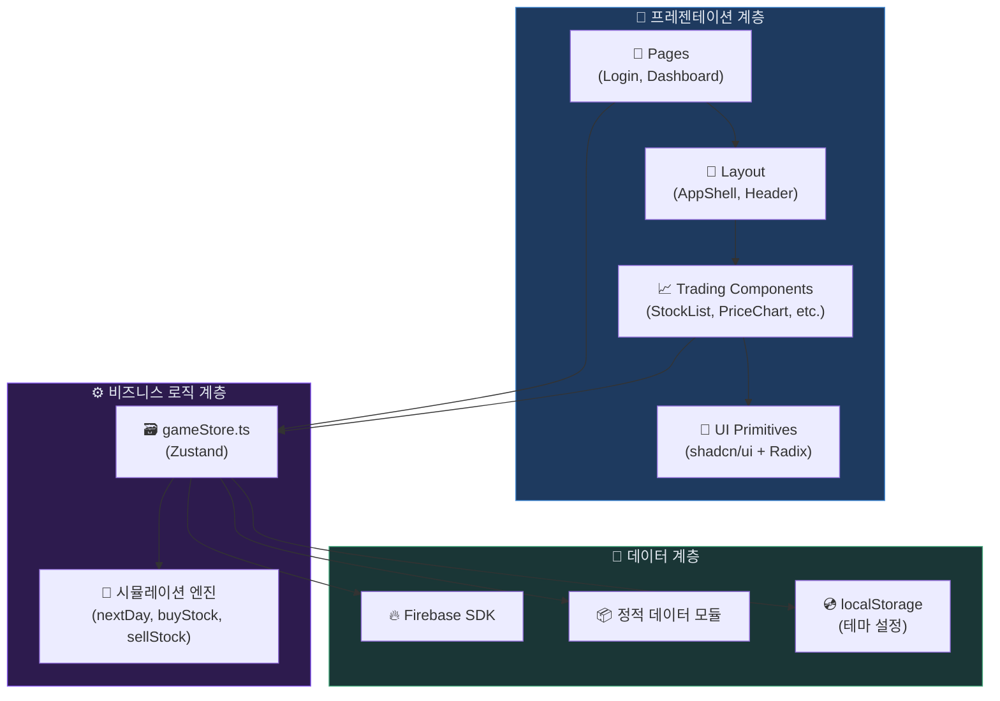
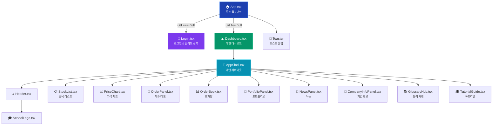
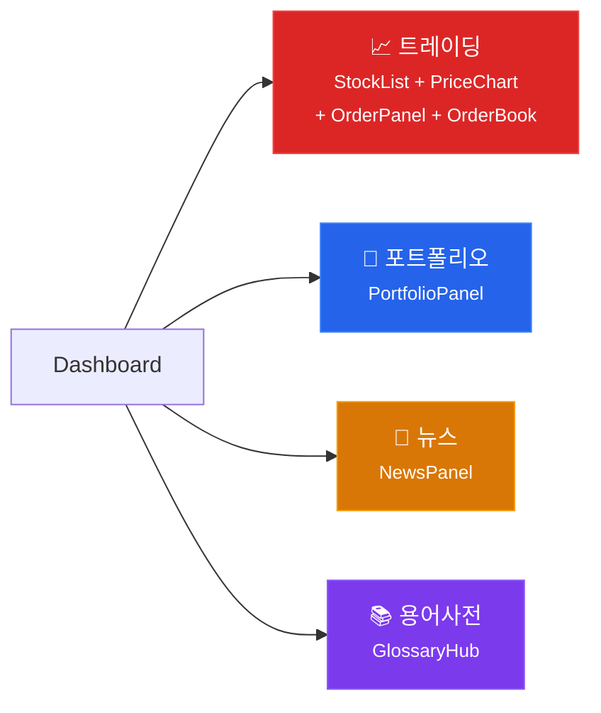
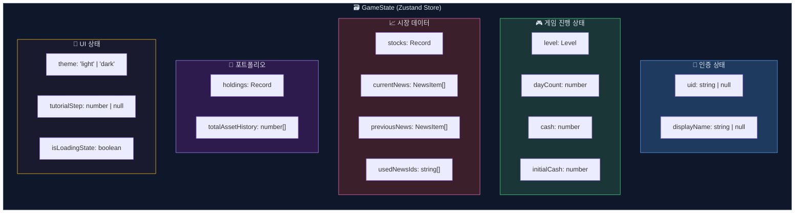
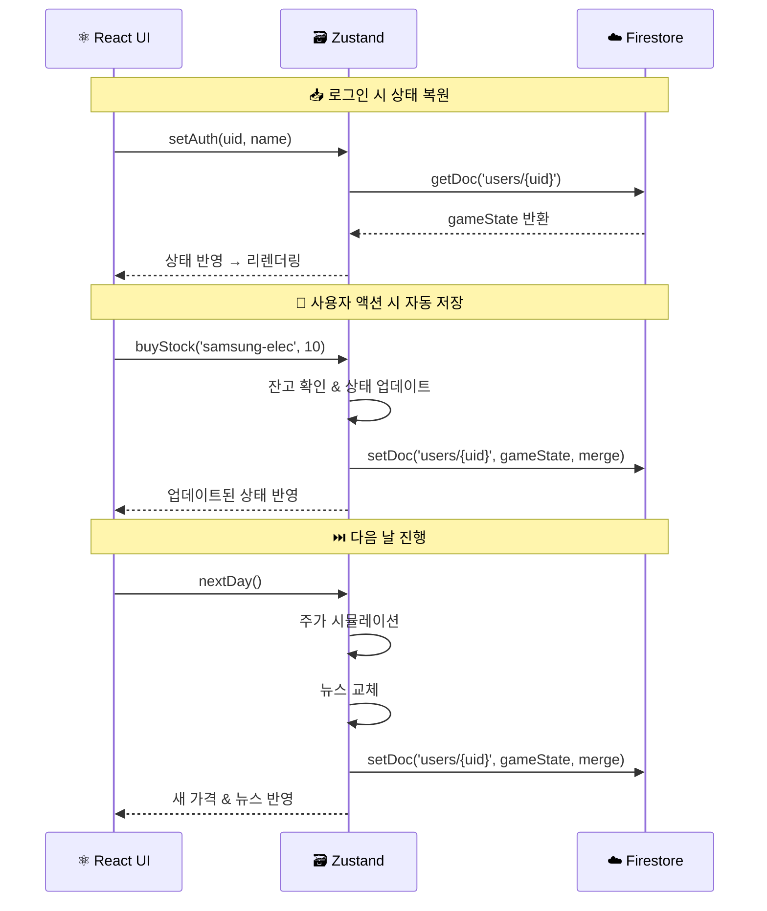
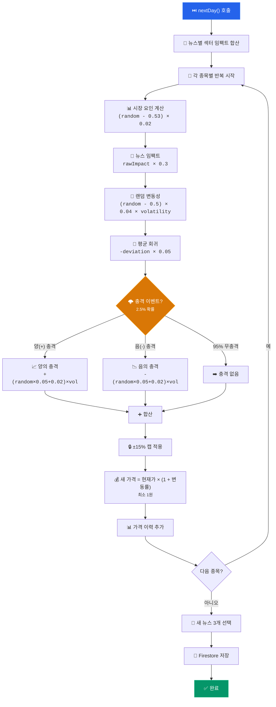
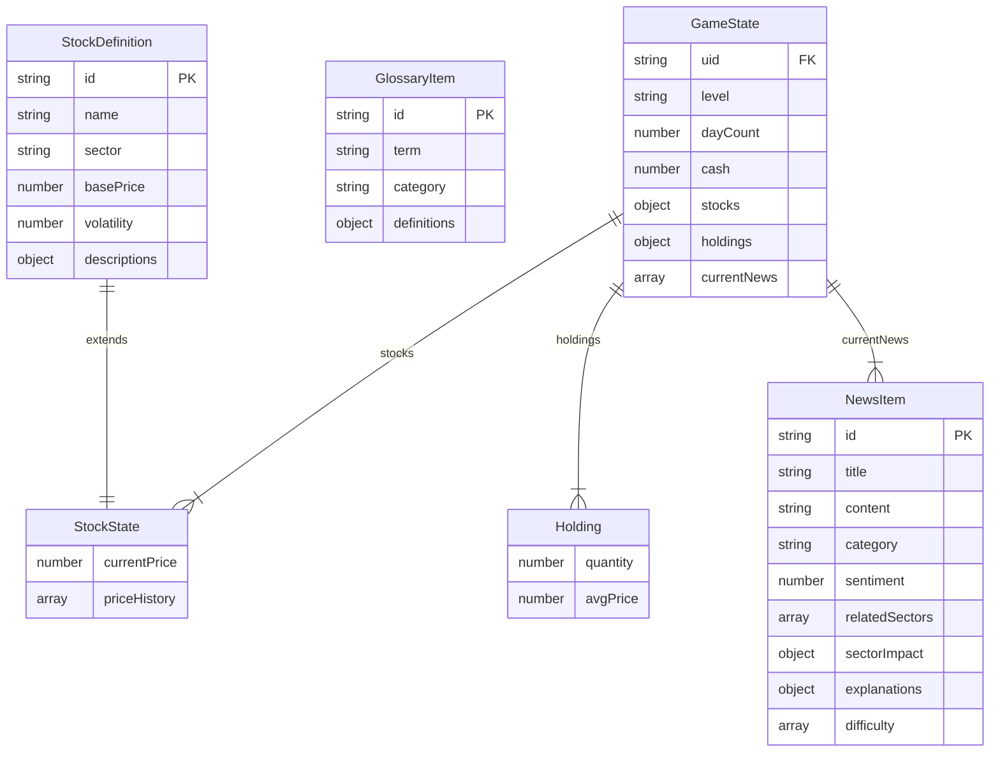
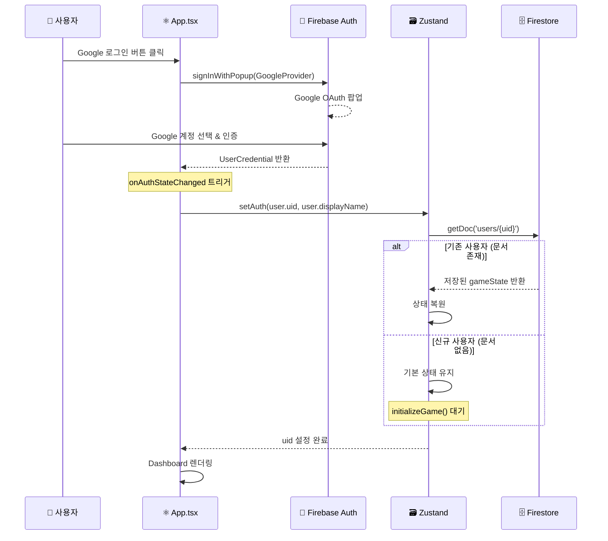
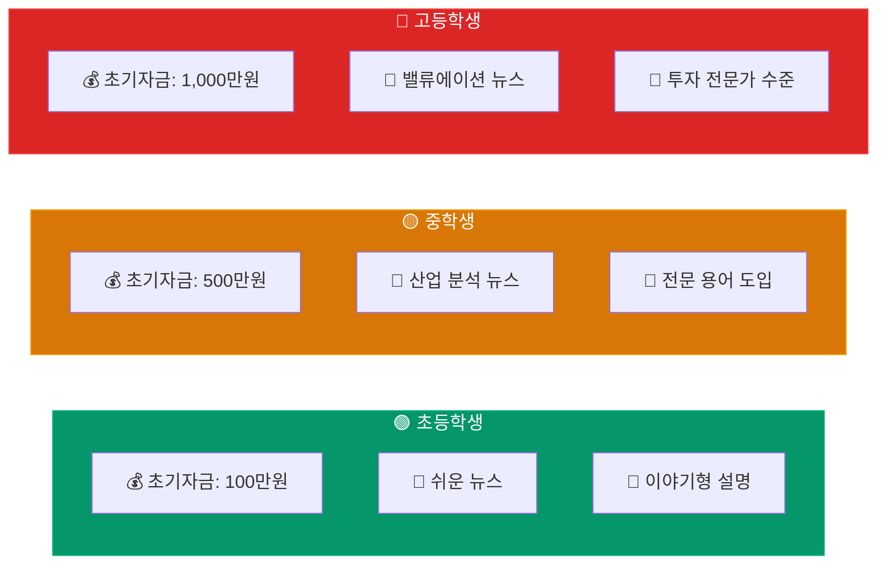

<div align="center">

# 📐 시스템 아키텍처

**스탁스쿨 (StockSchool) — 기술 아키텍처 문서**

<p>
  
  
  
</p>

</div>

---

## 📑 목차

- [1. 시스템 아키텍처 개요](#1--시스템-아키텍처-개요)
- [2. 프론트엔드 아키텍처](#2--프론트엔드-아키텍처)
- [3. 컴포넌트 계층 구조](#3--컴포넌트-계층-구조)
- [4. 상태 관리 아키텍처](#4--상태-관리-아키텍처)
- [5. 주가 시뮬레이션 엔진](#5--주가-시뮬레이션-엔진)
- [6. 데이터 모델](#6--데이터-모델)
- [7. 인증 플로우](#7--인증-플로우)
- [8. 난이도 시스템](#8--난이도-시스템)
- [9. 디렉토리 구조](#9--디렉토리-구조)

---

## 1. 🏗️ 시스템 아키텍처 개요

스탁스쿨은 **클라이언트 사이드 SPA (Single Page Application)** 아키텍처를 채택하고 있습니다. 별도의 백엔드 서버 없이 **Firebase BaaS(Backend as a Service)** 를 활용하여 인증과 데이터 영속성을 처리합니다.



> [!NOTE]
> 스탁스쿨은 서버리스 아키텍처로 설계되었습니다. 모든 게임 로직(주가 시뮬레이션, 거래 처리 등)은 클라이언트 측에서 실행되며, Firebase는 인증과 데이터 영속성만 담당합니다.

---

## 2. ⚛️ 프론트엔드 아키텍처

### 기술 계층 다이어그램



### 핵심 설계 원칙

| 원칙 | 설명 |
|:---:|:---|
| 🎯 **단일 Store** | Zustand 하나의 스토어로 모든 게임 상태를 중앙 관리 |
| 🔄 **단방향 데이터 흐름** | Store → UI → User Action → Store |
| 📦 **정적 데이터 분리** | 종목/뉴스/용어 데이터를 별도 모듈로 분리 |
| 💾 **자동 영속성** | 상태 변경 시 자동으로 Firestore에 저장 |
| 🎨 **컴포넌트 합성** | 작은 UI 프리미티브를 조합하여 복잡한 컴포넌트 구성 |

---

## 3. 🧩 컴포넌트 계층 구조



### 워크스페이스 탭 구성



---

## 4. 🗃️ 상태 관리 아키텍처

### Zustand Store 구조

게임의 모든 상태는 단일 Zustand 스토어(`gameStore.ts`)에서 관리됩니다.



### 상태 변경 & 영속성 플로우



---

## 5. 🎲 주가 시뮬레이션 엔진

### 알고리즘 흐름도



### 시뮬레이션 공식 요약

| 구성 요소 | 공식 | 설명 |
|:---|:---|:---|
| 🌍 시장 요인 | `(Math.random() - 0.53) × 0.02` | 약간의 음의 편향으로 무한 상승 방지 |
| 📰 뉴스 임팩트 | `rawImpact × 0.3` | 뉴스의 섹터 영향도를 0.3배로 스케일링 |
| 🎲 랜덤 변동성 | `(Math.random() - 0.5) × 0.04 × volatility` | 종목별 변동성 반영 |
| 📏 평균 회귀 | `-((currentPrice - basePrice) / basePrice) × 0.05` | 기준가로 복귀하는 힘 |
| 🌩️ 충격 이벤트 | 2.5% 확률, `(random × 0.05 + 0.02) × volatility` | 희귀한 대폭 변동 |
| 🔒 변동 제한 | `Math.max(-0.15, Math.min(0.15, total))` | 일일 최대 ±15% |

---

## 6. 📦 데이터 모델



> 📖 상세 데이터 모델은 [DATA_MODELS.md](./DATA_MODELS.md)를 참조하세요.

---

## 7. 🔐 인증 플로우



### Firestore 문서 구조

```
📁 users (Collection)
  └── 📄 {uid} (Document)
        ├── displayName: "홍길동"
        ├── updatedAt: "2026-05-20T..."
        └── gameState:
              ├── level: "elementary"
              ├── dayCount: 15
              ├── cash: 850000
              ├── initialCash: 1000000
              ├── stocks: { "samsung-elec": {...}, ... }
              ├── holdings: { "samsung-elec": { quantity: 5, avgPrice: 82000 } }
              ├── currentNews: [...]
              ├── previousNews: [...]
              ├── usedNewsIds: [...]
              ├── totalAssetHistory: [1000000, 1050000, ...]
              └── tutorialStep: null
```

---

## 8. 🎓 난이도 시스템



| 항목 | 🟢 초등학생 | 🟡 중학생 | 🔴 고등학생 |
|:---|:---:|:---:|:---:|
| 초기 자금 | ₩1,000,000 | ₩5,000,000 | ₩10,000,000 |
| 뉴스 난이도 | 일상생활 소재 | 산업/경제 분석 | 밸류에이션/재무 |
| 종목 설명 | 이야기형 | 사업 분석 | 투자 전문가 |
| 용어 정의 | 비유/예시 중심 | 개념 정의 | 이론/공식 포함 |
| 난이도 레이블 | `elementary` | `middle` | `high` |

---

## 9. 📁 디렉토리 구조

| 경로 | 역할 |
|:---|:---|
| `src/` | 소스 코드 루트 |
| `src/components/layout/` | 앱 전체 레이아웃 (셸, 헤더, 로고) |
| `src/components/trading/` | 트레이딩 관련 모든 기능 컴포넌트 |
| `src/components/ui/` | 재사용 가능한 기초 UI 프리미티브 (shadcn/ui) |
| `src/lib/` | 유틸리티, Firebase 설정, 정적 데이터 모듈 |
| `src/pages/` | 페이지 단위 컴포넌트 (Login, Dashboard) |
| `src/stores/` | Zustand 상태 관리 스토어 |
| `src/assets/` | 이미지, SVG 등 정적 자산 |
| `public/` | Vite 정적 파일 (파비콘 등) |
| `docs/` | 프로젝트 문서 |

---

<div align="center">

[⬆️ 맨 위로](#-시스템-아키텍처) • [📖 README로 돌아가기](../README.md)

</div>
