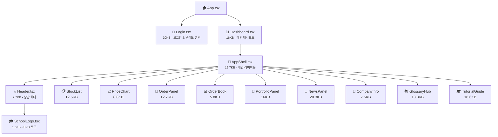

# 🧩 컴포넌트 가이드

**스탁스쿨 (StockSchool) — UI 컴포넌트 문서**

---

## 📑 컴포넌트 계층 구조

---

## 📐 레이아웃 컴포넌트

### AppShell.tsx (15.7KB)
메인 앱 레이아웃. 사이드바 + 콘텐츠 영역의 그리드 레이아웃을 구성합니다. 데스크톱에서는 사이드바 네비게이션, 모바일에서는 시트(Sheet) 기반 메뉴를 제공합니다. 일 진행 버튼, 워크스페이스 탭 네비게이션, 테마 토글, 리셋/로그아웃 기능을 포함합니다.

### Header.tsx (7.7KB)
상단 헤더 바. 로고, 앱 타이틀, 일수 카운터, 보유 현금 표시, 사용자 정보를 표시합니다.

### SchoolLogo.tsx (1.6KB)
신전(新殿) 스타일 건물과 상승하는 주가 추세선이 결합된 SVG 로고 컴포넌트입니다.

---

## 📈 트레이딩 컴포넌트

### StockList.tsx (12.5KB)
**종목 리스트** — 30개 종목을 섹터별로 그룹화하여 표시합니다.
- 🔍 검색 (이름/섹터)
- 🏷️ 섹터 필터 필(pill) 버튼
- 📈 미니 스파크라인 차트 (최근 10일)
- 🔴 상승 빨간색 / 🔵 하락 파란색 (한국 컨벤션)
- 📌 튜토리얼 Step 2 하이라이트

### PriceChart.tsx (8.8KB)
**가격 차트** — TradingView Lightweight Charts를 사용한 주가 차트입니다.
- 📊 Area 시리즈 (그라디언트 채움)
- 📏 5일 이동평균선 오버레이 (금색)
- 📉 볼륨 히스토그램
- ✚ 십자선(Crosshair) 지원
- 🌗 다크/라이트 테마 대응
- 📌 튜토리얼 Step 3 하이라이트

### OrderPanel.tsx (12.7KB)
**매수/매도 패널** — 거래 실행 인터페이스입니다.
- 🟢 매수 / 🔴 매도 탭 전환
- 📊 보유 현황 (평균가, 수익률)
- 🔢 수량 입력 (±1 버튼, 10%/25%/50%/100% 바로가기)
- 💰 예상 주문 금액 표시
- ✅ 토스트 알림 (sonner)
- 📌 튜토리얼 Step 4 하이라이트

### OrderBook.tsx (5.8KB)
**호가창** — 시뮬레이션된 매수/매도 호가를 표시합니다.
- 📕 매도 호가 5단계 (빨강)
- 📗 매수 호가 5단계 (파랑)
- 📏 스프레드 표시

### PortfolioPanel.tsx (16KB)
**포트폴리오 대시보드** — 투자 현황을 종합적으로 보여줍니다.
- 📊 요약 카드 (총 자산, 현금, 주식 평가액, 수익률)
- 📈 자산 추이 차트 (Recharts Area)
- 🍩 자산 배분 파이 차트 (Recharts Pie)
- 📋 보유 종목 테이블
- 📌 튜토리얼 Step 5 하이라이트

### NewsPanel.tsx (20.3KB)
**뉴스 패널** — 가장 큰 트레이딩 컴포넌트입니다.
- 📰 오늘의 뉴스 / 어제 뉴스 해설 탭
- 📄 헤드라인 리스트 + 상세 뷰 (마스터-디테일)
- 🔒 오늘 뉴스의 AI 해설은 잠금 (다음 날 공개)
- 🏷️ 감성 배지 (매우 호재 ~ 매우 악재)
- 📊 섹터 임팩트 진행 바
- 📌 튜토리얼 Step 1 하이라이트

### CompanyInfoPanel.tsx (7.5KB)
**기업 정보 패널** — 선택된 종목의 상세 분석입니다.
- 📊 핵심 지표 카드 (기준가, 변동성, 섹터)
- 📝 난이도별 기업 설명
- ⚠️ 투자 위험도 알림

### GlossaryHub.tsx (13.8KB)
**금융 용어 사전** — 16개 핵심 금융 용어를 학습합니다.
- 🔍 검색
- 🏷️ 카테고리 필터 (기초/분석/거시/심화)
- 📖 마스터-디테일 레이아웃
- 🎓 독립 레벨 스위처 (초급/중급/고급)
- 📌 튜토리얼 Step 6 하이라이트

### TutorialGuide.tsx (18.6KB)
**튜토리얼 가이드** — "스탁 쌤" 온보딩 시스템입니다.
- 📋 8단계 (0~7): 환영 → 뉴스 → 종목 → 차트 → 주문 → 포트폴리오 → 용어 → 졸업
- 🎭 오버레이 모드 (Step 0, 7) + 플로팅 버블 모드 (Step 1~6)
- 📊 진행 바
- 🔄 워크스페이스 자동 전환
- 💾 완료 상태 localStorage 저장

---

## 🧩 UI 기초 컴포넌트 (shadcn/ui)

| 컴포넌트 | 파일 | 용도 |
|:---|:---|:---|
| Button | `button.tsx` | 버튼 (variant: default, outline, ghost, destructive) |
| Card | `card.tsx` | 카드 컨테이너 (Header, Content, Footer) |
| Dialog | `dialog.tsx` | 모달 다이얼로그 |
| Input | `input.tsx` | 텍스트 입력 필드 |
| Label | `label.tsx` | 접근성 라벨 |
| ScrollArea | `scroll-area.tsx` | 커스텀 스크롤바 영역 |
| Sheet | `sheet.tsx` | 사이드 패널 (모바일 메뉴) |
| Sonner | `sonner.tsx` | 토스트 알림 래퍼 |
| Table | `table.tsx` | 데이터 테이블 |
| Tabs | `tabs.tsx` | 탭 네비게이션 |

---

## 🎨 디자인 시스템 요약

### 컬러 컨벤션 (한국 주식 시장)

| 용도 | 색상 | 의미 |
|:---|:---:|:---|
| 상승 | 🔴 빨강 | 주가 상승 |
| 하락 | 🔵 파랑 | 주가 하락 |
| 강조 | 🟡 금색 | 크로스헤어, 액센트 |
| 매수 | 🟢 초록 | 매수 버튼 |
| 매도 | 🔴 빨강 | 매도 버튼 |

### 타이포그래피

| 용도 | 폰트 |
|:---|:---|
| 영문 본문 | Inter |
| 한글 본문 | Noto Sans KR |
| 제목 | Outfit |

---

[⬆️ 맨 위로](#-컴포넌트-가이드) • [📐 아키텍처](./ARCHITECTURE.md) • [📖 README](../README.md)

