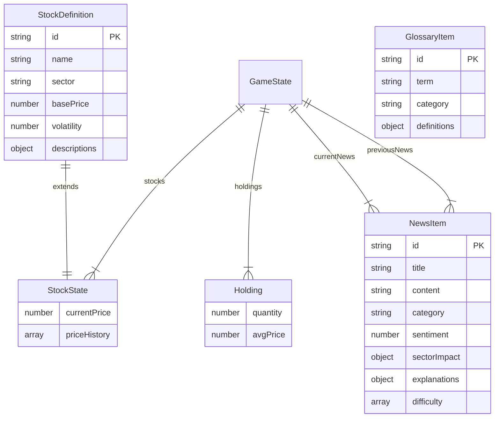

<div align="center">

# 📦 데이터 모델

**스탁스쿨 (StockSchool) — 인터페이스 & 데이터 구조 문서**

</div>

---

## 📑 목차

- [1. 데이터 모델 개요](#1--데이터-모델-개요)
- [2. StockDefinition](#2--stockdefinition)
- [3. StockState](#3--stockstate)
- [4. NewsItem](#4--newsitem)
- [5. GlossaryItem](#5--glossaryitem)
- [6. Holding](#6--holding)
- [7. GameState](#7--gamestate)
- [8. Firestore 문서 구조](#8--firestore-문서-구조)
- [9. 섹터 목록](#9--섹터-목록)
- [10. 전체 종목 목록](#10--전체-종목-목록)

---

## 1. 🗺️ 데이터 모델 개요



---

## 2. 📈 StockDefinition

> **파일:** `src/lib/stockData.ts`

종목의 기본 정보를 정의하는 인터페이스입니다.

```typescript
export interface StockDefinition {
  id: string;
  name: string;
  sector: string;
  basePrice: number;
  volatility: number;
  descriptions: {
    elementary: string;
    middle: string;
    high: string;
  };
}
```

| 필드 | 타입 | 설명 | 예시 |
|:---|:---|:---|:---|
| `id` | `string` | 고유 식별자 (kebab-case) | `"samsung-elec"` |
| `name` | `string` | 한글 기업명 | `"삼성전자"` |
| `sector` | `string` | 섹터명 `한글(English)` 형식 | `"기술(Tech)"` |
| `basePrice` | `number` | 기준가 (원) | `83000` |
| `volatility` | `number` | 변동성 계수 (0.5~1.8) | `0.7` |
| `descriptions` | `object` | 3단계 기업 설명 | - |
| ↳ `elementary` | `string` | 초등학생용 이야기형 설명 | - |
| ↳ `middle` | `string` | 중학생용 산업 분석 | - |
| ↳ `high` | `string` | 고등학생용 밸류에이션 분석 | - |

---

## 3. 📊 StockState

> **파일:** `src/stores/gameStore.ts`

런타임 주식 상태입니다. `StockDefinition`을 확장합니다.

```typescript
export interface StockState extends StockDefinition {
  currentPrice: number;
  priceHistory: number[];
}
```

| 필드 | 타입 | 설명 |
|:---|:---|:---|
| *(StockDefinition 전체)* | - | 기본 종목 정보 상속 |
| `currentPrice` | `number` | 현재 시뮬레이션 가격 |
| `priceHistory` | `number[]` | 일별 가격 기록 배열 |

---

## 4. 📰 NewsItem

> **파일:** `src/lib/newsData.ts`

```typescript
export interface NewsItem {
  id: string;
  title: string;
  content: string;
  category: 'macro' | 'sector' | 'company' | 'global';
  sentiment: number;
  relatedSectors: string[];
  sectorImpact: Record<string, number>;
  explanations: {
    elementary: string;
    middle: string;
    high: string;
  };
  difficulty: string[];
}
```

| 필드 | 타입 | 설명 | 범위/예시 |
|:---|:---|:---|:---|
| `id` | `string` | 고유 식별자 | `"news-el-1"` |
| `title` | `string` | 헤드라인 | - |
| `content` | `string` | 뉴스 본문 | - |
| `category` | `enum` | 카테고리 | `macro` / `sector` / `company` / `global` |
| `sentiment` | `number` | 감성 점수 | `-2` ~ `+2` |
| `relatedSectors` | `string[]` | 관련 섹터 | `["기술(Tech)"]` |
| `sectorImpact` | `Record` | 섹터별 영향도 | `{ "기술(Tech)": 0.08 }` |
| `explanations` | `object` | 3단계 AI 해설 | - |
| `difficulty` | `string[]` | 표시 대상 레벨 | `["elementary"]` |

### 감성 점수 (Sentiment)

| 값 | 의미 | 레이블 |
|:---:|:---:|:---|
| +2 | 매우 호재 | 🟢 매우 호재 |
| +1 | 호재 | 🟩 호재 |
| 0 | 중립 | ⬜ 중립 |
| -1 | 악재 | 🟧 악재 |
| -2 | 매우 악재 | 🔴 매우 악재 |

---

## 5. 📚 GlossaryItem

> **파일:** `src/lib/glossaryData.ts`

```typescript
export interface GlossaryItem {
  id: string;
  term: string;
  category: 'basic' | 'analysis' | 'macro' | 'advanced';
  definitions: {
    elementary: string;
    middle: string;
    high: string;
  };
}
```

| 카테고리 | 레이블 | 포함 용어 |
|:---:|:---|:---|
| `basic` | 주식 기초 | 주식, 시가총액, 배당금, 거래량, 유동성, 블루칩 |
| `analysis` | 주식 분석 | PER, PBR, 이동평균선, ROE |
| `macro` | 거시 경제 | 기준금리, 인플레이션, GDP, 양적완화 |
| `advanced` | 심화 지식 | 변동성, 공매도 |

---

## 6. 💼 Holding

```typescript
export interface Holding {
  quantity: number;
  avgPrice: number;
}
```

| 필드 | 타입 | 설명 |
|:---|:---|:---|
| `quantity` | `number` | 보유 수량 (주) |
| `avgPrice` | `number` | 평균 매수 가격 (원) |

---

## 7. 🎮 GameState

> **파일:** `src/stores/gameStore.ts`

```typescript
interface GameState {
  // 인증
  uid: string | null;
  displayName: string | null;
  isLoadingState: boolean;
  
  // 게임 진행
  level: 'elementary' | 'middle' | 'high';
  dayCount: number;
  cash: number;
  initialCash: number;
  
  // 시장 데이터
  stocks: Record<string, StockState>;
  currentNews: NewsItem[];
  previousNews: NewsItem[];
  usedNewsIds: string[];
  
  // 포트폴리오
  holdings: Record<string, Holding>;
  totalAssetHistory: number[];
  
  // UI
  theme: 'light' | 'dark';
  tutorialStep: number | null;
}
```

---

## 8. 🗄️ Firestore 문서 구조

```
📁 users (Collection)
└── 📄 {uid} (Document)
      ├── displayName: string
      ├── updatedAt: string (ISO 8601)
      └── gameState: object
            ├── level: string
            ├── dayCount: number
            ├── cash: number
            ├── initialCash: number
            ├── stocks: map
            ├── holdings: map
            ├── currentNews: array
            ├── previousNews: array
            ├── usedNewsIds: array
            ├── totalAssetHistory: array
            └── tutorialStep: number | null
```

---

## 9. 🏭 섹터 목록

| # | 섹터 코드 | 한글명 | 종목 수 |
|:---:|:---|:---|:---:|
| 1 | `기술(Tech)` | 기술 | 2 |
| 2 | `자동차(Auto)` | 자동차 | 3 |
| 3 | `에너지(Energy)` | 에너지 | 4 |
| 4 | `인터넷(Internet)` | 인터넷 | 2 |
| 5 | `금융(Finance)` | 금융 | 3 |
| 6 | `바이오(Bio)` | 바이오 | 2 |
| 7 | `방산(Defense)` | 방산 | 1 |
| 8 | `식품(Food)` | 식품 | 1+ |
| 9 | `화학(Chemical)` | 화학 | 2 |
| 10 | `소재(Material)` | 소재 | 1 |
| 11 | `통신(Telecom)` | 통신 | 2 |
| 12 | `조선(Shipbuilding)` | 조선 | 1 |
| 13 | `건설(Construction)` | 건설 | 1 |
| 14 | `화장품(Cosmetics)` | 화장품 | 1+ |
| 15 | `해운(Shipping)` | 해운 | 1+ |

---

## 10. 📋 전체 종목 목록

| # | ID | 종목명 | 섹터 | 기준가(₩) | 변동성 |
|:---:|:---|:---|:---|---:|:---:|
| 1 | `samsung-elec` | 삼성전자 | 기술(Tech) | 83,000 | 0.7 |
| 2 | `sk-hynix` | SK하이닉스 | 기술(Tech) | 210,000 | 1.3 |
| 3 | `hyundai-motor` | 현대차 | 자동차(Auto) | 280,000 | 0.9 |
| 4 | `kia` | 기아 | 자동차(Auto) | 135,000 | 1.0 |
| 5 | `lg-energy` | LG에너지솔루션 | 에너지(Energy) | 380,000 | 1.4 |
| 6 | `naver` | 네이버 | 인터넷(Internet) | 220,000 | 1.1 |
| 7 | `kb-finance` | KB금융 | 금융(Finance) | 85,000 | 0.6 |
| 8 | `samsung-bio` | 삼성바이오로직스 | 바이오(Bio) | 880,000 | 1.0 |
| 9 | `hanwha-aero` | 한화에어로스페이스 | 방산(Defense) | 260,000 | 1.4 |
| 10 | `samyang-food` | 삼양식품 | 식품(Food) | 650,000 | 1.6 |
| 11 | `kakao` | 카카오 | 인터넷(Internet) | 55,000 | 1.3 |
| 12 | `shinhan` | 신한지주 | 금융(Finance) | 45,000 | 0.7 |
| 13 | `samsung-life` | 삼성생명 | 금융(Finance) | 90,000 | 0.5 |
| 14 | `celltrion` | 셀트리온 | 바이오(Bio) | 190,000 | 1.2 |
| 15 | `lg-chem` | LG화학 | 화학(Chemical) | 450,000 | 1.1 |
| 16 | `posco-hd` | POSCO홀딩스 | 소재(Material) | 400,000 | 1.5 |
| 17 | `posco-future` | 포스코퓨처엠 | 화학(Chemical) | 290,000 | 1.6 |
| 18 | `samsung-sdi` | 삼성SDI | 에너지(Energy) | 420,000 | 1.2 |
| 19 | `hyundai-mobis` | 현대모비스 | 자동차(Auto) | 250,000 | 0.8 |
| 20 | `s-oil` | S-Oil | 에너지(Energy) | 75,000 | 1.4 |
| 21 | `sk-innovation` | SK이노베이션 | 에너지(Energy) | 120,000 | 1.5 |
| 22 | `skt` | SK텔레콤 | 통신(Telecom) | 52,000 | 0.5 |
| 23 | `kt` | KT | 통신(Telecom) | 38,000 | 0.6 |
| 24 | `hd-hyundai-hi` | HD현대중공업 | 조선(Shipbuilding) | 130,000 | 1.5 |
| 25 | `hyundai-const` | 현대건설 | 건설(Construction) | 40,000 | 1.2 |

---

<div align="center">

[⬆️ 맨 위로](#-데이터-모델) • [📐 아키텍처](./ARCHITECTURE.md) • [📖 README](../README.md)

</div>
