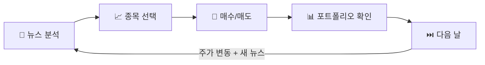
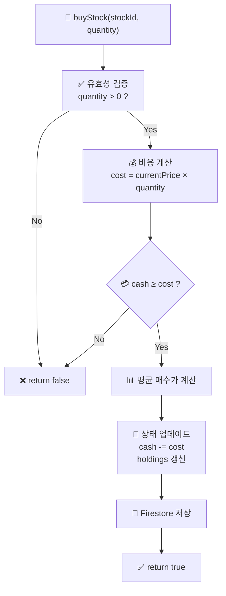
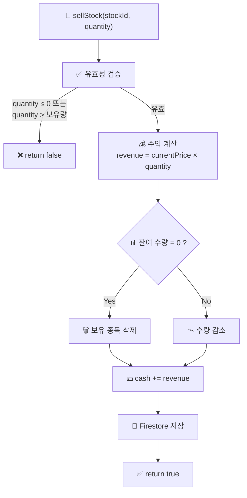
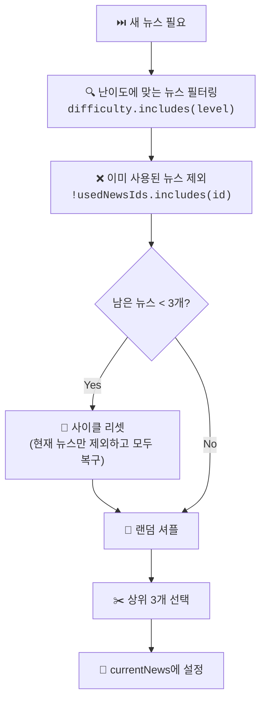
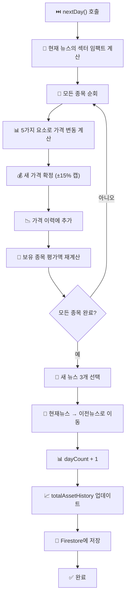

<div align="center">

# 🎲 게임 메카닉스

**스탁스쿨 (StockSchool) — 게임 로직 & 시뮬레이션 엔진 문서**

<p>
  
  
  
</p>

</div>

---

## 📑 목차

- [1. 게임 개요](#1--게임-개요)
- [2. 난이도 시스템](#2--난이도-시스템)
- [3. 주가 시뮬레이션 알고리즘](#3--주가-시뮬레이션-알고리즘)
- [4. 매매 시스템](#4--매매-시스템)
- [5. 뉴스 시스템](#5--뉴스-시스템)
- [6. 포트폴리오 관리](#6--포트폴리오-관리)
- [7. 일(Day) 진행 시스템](#7--일day-진행-시스템)

---

## 1. 🎮 게임 개요

스탁스쿨의 게임 루프는 **일(Day) 단위**로 진행됩니다.



### 게임 목표

> 💡 **가상 자금으로 주식을 사고팔아 수익을 극대화하면서, 뉴스 분석과 금융 용어를 자연스럽게 학습합니다.**

---

## 2. 🎓 난이도 시스템

### 난이도별 비교표

| 항목 | 🟢 초등학생 (`elementary`) | 🟡 중학생 (`middle`) | 🔴 고등학생 (`high`) |
|:---|:---:|:---:|:---:|
| **초기 자금** | ₩1,000,000 | ₩5,000,000 | ₩10,000,000 |
| **뉴스 스타일** | 일상 이야기 | 산업 분석 | 밸류에이션 전문 |
| **종목 설명** | 비유/예시 | 사업 모델 분석 | IR 리포트 수준 |
| **용어 정의** | 피자 가게 비유 | 개념 정의 | 수식/이론 포함 |

### 초기 자금 결정 로직

```typescript
const getInitialCash = (level: Level) => {
  if (level === 'elementary') return 1_000_000;   // 100만원
  if (level === 'middle')     return 5_000_000;   // 500만원
  return 10_000_000;                               // 1,000만원 (high)
};
```

### 뉴스 콘텐츠 예시

**같은 이벤트, 3가지 설명:**

<table>
<tr><th>🟢 초등학생</th></tr>
<tr><td>삼성전자는 우리나라에서 제일 유명하고 전 세계에서도 손꼽히는 아주 큰 공장이에요. 스마트폰인 '갤럭시' 시리즈로 전 세계 사람들의 마음을 사로잡았고...</td></tr>
<tr><th>🟡 중학생</th></tr>
<tr><td>대한민국 KOSPI 시가총액 부동의 1위 기업인 삼성전자는 반도체(DS), 스마트폰(MX), 가전(CE), 디스플레이(DP) 등 다양한 IT 사업 포트폴리오를 보유하고 있습니다...</td></tr>
<tr><th>🔴 고등학생</th></tr>
<tr><td>대한민국 증시의 벤치마크이자 글로벌 IT H/W 섹터의 대장주입니다. 밸류에이션은 메모리 반도체의 ASP 추이와 Bit Growth에 연동됩니다. HBM 퀄 통과 여부 및 공급 물량 확대가 핵심...</td></tr>
</table>

---

## 3. 📈 주가 시뮬레이션 알고리즘

### 핵심 공식

매일(`nextDay()`) 호출 시 각 종목의 가격이 다음 **5가지 요소**의 합으로 결정됩니다:

```
새 가격 = 현재가 × (1 + totalChange)

totalChange = marketFactor + newsImpact + randomChange + meanReversion + shock
             (시장 요인)    (뉴스 영향)   (랜덤 변동)    (평균 회귀)     (충격)

단, totalChange는 [-0.15, +0.15] 범위로 제한 (일일 최대 ±15%)
```

### 각 구성 요소 상세

#### 1️⃣ 시장 요인 (Market Factor)

```typescript
const marketFactor = (Math.random() - 0.53) * 0.02;
```

| 항목 | 값 |
|:---|:---|
| 범위 | 약 -1.06% ~ +0.94% |
| 편향 | **약간의 음의 편향** (0.5 대신 0.53) |
| 목적 | 무한 상승 트렌드 방지, 현실적 시장 시뮬레이션 |

#### 2️⃣ 뉴스 임팩트 (News Impact)

```typescript
const rawImpact = sectorImpacts[stock.sector] || 0;
const newsImpact = rawImpact * 0.3;
```

| 항목 | 값 |
|:---|:---|
| 원본 범위 | -9% ~ +9% (뉴스 데이터 정의) |
| 스케일링 | **×0.3** (현실적 단일 뉴스 영향: 약 ±2.7%) |
| 적용 | 동일 섹터 뉴스가 여러 개면 누적 |

#### 3️⃣ 랜덤 변동성 (Random Volatility)

```typescript
const randomChange = (Math.random() - 0.5) * 0.04 * stock.volatility;
```

| 항목 | 값 |
|:---|:---|
| 기본 범위 | ±2% |
| 변동성 계수 | 종목별 `volatility` (0.5 ~ 1.8) |
| 실제 범위 | 삼성생명(0.5): ±1% ~ HMM(1.8): ±3.6% |

#### 4️⃣ 평균 회귀 (Mean Reversion)

```typescript
const deviation = (stock.currentPrice - stock.basePrice) / stock.basePrice;
const meanReversion = -deviation * 0.05;
```

| 항목 | 값 |
|:---|:---|
| 목적 | 가격이 기준가에서 벗어날수록 복귀 압력 |
| 강도 | 이탈률의 5% |
| 예시 | 기준가 대비 +50% → -2.5% 복귀 압력 |

#### 5️⃣ 충격 이벤트 (Shock Events)

```typescript
const shockRoll = Math.random();
let shock = 0;
if (shockRoll < 0.025) {           // 2.5% 확률 (음의 충격)
  shock = -(Math.random() * 0.05 + 0.02) * stock.volatility;
} else if (shockRoll > 0.975) {    // 2.5% 확률 (양의 충격)
  shock = (Math.random() * 0.05 + 0.02) * stock.volatility;
}
```

| 항목 | 값 |
|:---|:---|
| 발생 확률 | 각 방향 **2.5%** (총 5%) |
| 충격 크기 | 2% ~ 7% × 변동성 |
| 목적 | 실제 주식 시장의 블랙스완 이벤트 시뮬레이션 |

### 가격 확정

```typescript
let totalChange = marketFactor + newsImpact + randomChange + meanReversion + shock;
totalChange = Math.max(-0.15, Math.min(0.15, totalChange));  // ±15% 캡

let newPrice = stock.currentPrice * (1 + totalChange);
newPrice = Math.max(1, Math.round(newPrice));  // 최소 1원, 정수
```

> [!WARNING]
> 모든 가격 변동은 일일 **±15%**로 제한됩니다. 이는 한국 주식 시장의 상한/하한가(±30%)보다 보수적인 설정입니다.

---

## 4. 🛒 매매 시스템

### 매수 (Buy)



**평균 매수가 계산 공식:**

```
새 평균 매수가 = (기존수량 × 기존평균가 + 추가비용) / 총 수량
```

```typescript
const newQuantity = currentHolding.quantity + quantity;
const newTotalCost = (currentHolding.quantity * currentHolding.avgPrice) + cost;
const newAvgPrice = Math.round(newTotalCost / newQuantity);
```

### 매도 (Sell)



---

## 5. 📰 뉴스 시스템

### 뉴스 데이터 구조

| 필드 | 타입 | 설명 |
|:---|:---|:---|
| `id` | string | 고유 식별자 (예: `news-el-1`) |
| `title` | string | 뉴스 헤드라인 |
| `content` | string | 뉴스 본문 (상세 기사) |
| `category` | enum | `macro` / `sector` / `company` / `global` |
| `sentiment` | number | -2(매우 악재) ~ +2(매우 호재) |
| `sectorImpact` | Record | 섹터별 영향도 (예: `{ "기술(Tech)": 0.08 }`) |
| `explanations` | object | 3단계 AI 해설 |
| `difficulty` | string[] | 표시 대상 레벨 |

### 뉴스 선택 알고리즘



### 뉴스 카테고리

| 카테고리 | 레이블 | 설명 |
|:---:|:---|:---|
| `macro` | 🌍 거시경제 | 금리, 환율, GDP 등 거시 변수 |
| `sector` | 🏭 산업/경제 | 특정 산업 동향 |
| `company` | 🏢 기업/종목 | 개별 기업 이슈 |
| `global` | 🌐 글로벌 | 국제 정세, 해외 시장 |

### 뉴스 → 주가 영향 흐름

```
뉴스 A: { sectorImpact: { "기술(Tech)": 0.08, "에너지(Energy)": -0.04 } }
뉴스 B: { sectorImpact: { "기술(Tech)": 0.03 } }
뉴스 C: { sectorImpact: { "자동차(Auto)": 0.06 } }

→ 섹터별 임팩트 합산:
  기술(Tech): 0.08 + 0.03 = 0.11  →  × 0.3  = 0.033 (+3.3%)
  에너지(Energy): -0.04            →  × 0.3  = -0.012 (-1.2%)
  자동차(Auto): 0.06               →  × 0.3  = 0.018 (+1.8%)
```

---

## 6. 💼 포트폴리오 관리

### 자산 계산

```
총 자산 = 보유 현금 + Σ(종목별 현재가 × 보유 수량)
수익률 = ((총 자산 - 초기 자금) / 초기 자금) × 100%
```

### 종목별 손익 계산

```
평가 금액 = 현재가 × 보유 수량
매입 금액 = 평균 매수가 × 보유 수량
평가 손익 = 평가 금액 - 매입 금액
수익률 = ((현재가 - 평균 매수가) / 평균 매수가) × 100%
```

### 자산 이력 추적

매일 `nextDay()` 호출 시 `totalAssetHistory` 배열에 현재 총 자산을 기록합니다:

```typescript
totalAssetHistory: [...totalAssetHistory, cash + totalStockValue]
```

---

## 7. ⏭️ 일(Day) 진행 시스템

### nextDay() 전체 흐름



---

<div align="center">

[⬆️ 맨 위로](#-게임-메카닉스) • [📐 아키텍처](./ARCHITECTURE.md) • [📖 README](../README.md)

</div>
