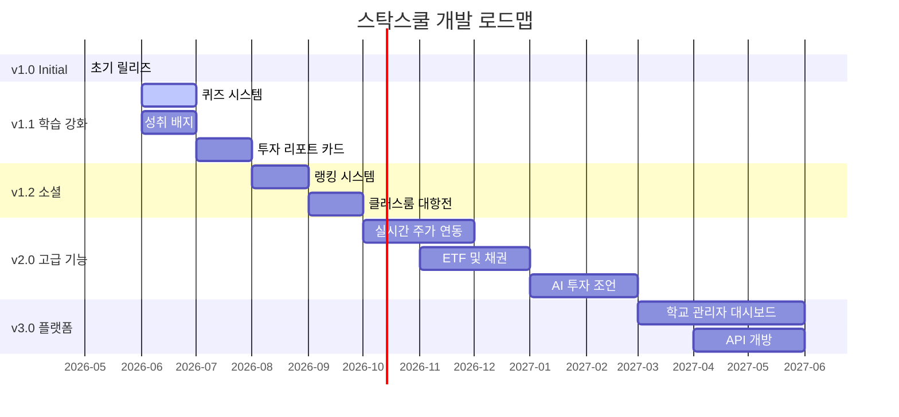

# 🗺️ 프로젝트 로드맵

**스탁스쿨 (StockSchool) — 향후 개발 계획**

---

## 🎯 비전

> *"모든 학생이 안전하고 재미있게 금융 투자를 배울 수 있는 최고의 교육 플랫폼"*

---

## 📊 로드맵 타임라인

---

## ✅ 완료된 기능 (v1.0.0)

| 상태 | 기능 |
|:---:|:---|
| ✅ | Google 인증 시스템 |
| ✅ | 3단계 난이도 시스템 (초등/중등/고등) |
| ✅ | 30개 한국 실제 기업 종목 |
| ✅ | 뉴스 기반 주가 시뮬레이션 엔진 |
| ✅ | 매수/매도 거래 시스템 |
| ✅ | 포트폴리오 관리 대시보드 |
| ✅ | TradingView 기반 가격 차트 |
| ✅ | 호가창 시뮬레이션 |
| ✅ | 기업 정보 패널 (난이도별) |
| ✅ | 금융 용어 사전 (16개 용어) |
| ✅ | 인터랙티브 튜토리얼 (8단계) |
| ✅ | 다크/라이트 테마 |
| ✅ | Firebase Firestore 데이터 영속성 |
| ✅ | 섹터별 필터링 & 검색 |

---

## 📚 Phase 2 — 학습 강화 (v1.1.0) `계획 중`

| 상태 | 기능 | 설명 |
|:---:|:---|:---|
| 📝 | 퀴즈 시스템 | 매 거래일 후 학습 확인 퀴즈 |
| 📝 | 성취 배지 & 레벨 | 거래 횟수, 수익률 기반 뱃지 |
| 📝 | 투자 성과 리포트 카드 | 주간/월간 투자 성과 요약 |
| 📝 | 마켓 타이머 | 시장 개장/폐장 시간 시뮬레이션 |
| 📝 | 사운드 이펙트 | 거래 성립음, 알림음 |

---

## 🏆 Phase 3 — 소셜 & 경쟁 (v1.2.0) `계획 중`

| 상태 | 기능 | 설명 |
|:---:|:---|:---|
| 📝 | 사용자 랭킹 | 수익률 기반 전체 순위 |
| 📝 | 클래스룸 대항전 | 반/학교 단위 그룹 대결 |
| 📝 | 친구 초대 | 같이 트레이딩하는 친구 시스템 |
| 📝 | 부모님/선생님 모니터링 | 관리자 대시보드 |

---

## 🚀 Phase 4 — 고급 기능 (v2.0.0) `장기 계획`

| 상태 | 기능 | 설명 |
|:---:|:---|:---|
| 📝 | 실시간 실제 주가 연동 | 모의 주가와 실제 주가 비교 |
| 📝 | ETF & 채권 거래 | 다양한 금융 상품 |
| 📝 | 선물/옵션 개념 소개 | 파생상품 교육 |
| 📝 | AI 투자 조언 튜터 | LLM 기반 개인화 조언 |
| 📝 | 다국어 지원 | English, 日本語 |
| 📝 | PWA 지원 | 오프라인 접근, 설치 가능 |

---

## 🌐 Phase 5 — 플랫폼 (v3.0.0) `비전`

| 상태 | 기능 | 설명 |
|:---:|:---|:---|
| 📝 | 학교 관리자 대시보드 | 학교별 학생 관리 |
| 📝 | 교사 커리큘럼 연동 | 수업 계획과 통합 |
| 📝 | API 개방 | 외부 서비스 연동 |
| 📝 | 데이터 분석 & 인사이트 | 학습 패턴 분석 |
| 📝 | COPPA 컴플라이언스 | 아동 보호법 준수 |

---

## 🔧 기술 부채 (Technical Debt)

| 우선순위 | 항목 | 설명 |
|:---:|:---|:---|
| 🔴 | 테스트 코드 추가 | Vitest + React Testing Library |
| 🔴 | E2E 테스트 | Playwright |
| 🟡 | 코드 스플리팅 | React.lazy + Suspense |
| 🟡 | 접근성 감사 | WCAG 2.1 AA 준수 |
| 🟢 | SEO 최적화 | 메타 태그, SSR 고려 |
| 🟢 | CI/CD 파이프라인 | GitHub Actions |
| 🟢 | 로깅 & 모니터링 | Sentry, Analytics |

---

## 💡 기여 원하는 영역

| 라벨 | 설명 |
|:---|:---|
| `good first issue` | 처음 기여자에게 적합한 이슈 |
| `help wanted` | 도움이 필요한 이슈 |
| `enhancement` | 기능 개선 제안 |
| `documentation` | 문서 개선 |
| `bug` | 버그 수정 |

---

[⬆️ 맨 위로](#-프로젝트-로드맵) • [📖 README](../README.md)

