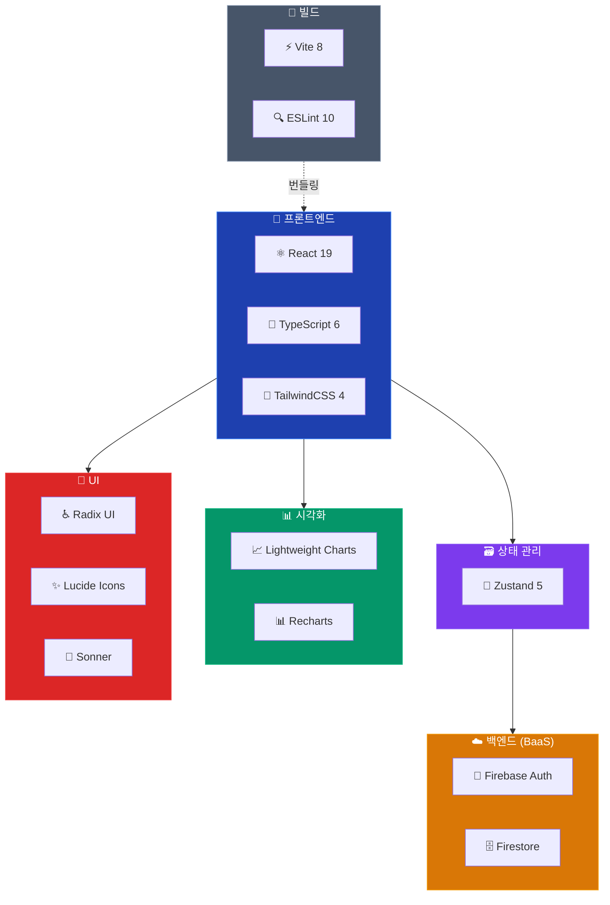

# 🔧 기술 스택

**스탁스쿨 (StockSchool) — 기술 스택 상세 문서**

  
  
  
  

---

## 📑 목차

- [1. 기술 스택 개요](#1--기술-스택-개요)
- [2. 코어 기술](#2--코어-기술)
- [3. 스타일링](#3--스타일링)
- [4. 상태 관리](#4--상태-관리)
- [5. 백엔드 서비스](#5--백엔드-서비스)
- [6. UI 컴포넌트](#6--ui-컴포넌트)
- [7. 차트 & 시각화](#7--차트--시각화)
- [8. 유틸리티](#8--유틸리티)
- [9. 개발 도구](#9--개발-도구)
- [10. 기술 선택 이유](#10--기술-선택-이유)

---

## 1. 🗺️ 기술 스택 개요

---

## 2. ⚛️ 코어 기술

### React 19.2

| 항목 | 내용 |
|:---|:---|
| **버전** | 19.2.6 |
| **용도** | UI 라이브러리 |
| **사용 기능** | Hooks (useState, useEffect, useMemo, useRef), Conditional Rendering, Portals, StrictMode |

### TypeScript 6.0

| 항목 | 내용 |
|:---|:---|
| **버전** | ~6.0.2 |
| **타겟** | ES2023 |
| **모듈** | ESNext (Bundler Resolution) |
| **주요 설정** | Strict mode, Path aliases (`@/*` → `./src/*`) |

### Vite 8.0

| 항목 | 내용 |
|:---|:---|
| **버전** | 8.0.12 |
| **용도** | 빌드 도구 & 개발 서버 |
| **플러그인** | `@vitejs/plugin-react` (Oxc), `@tailwindcss/vite` |
| **특징** | ESM 기반 HMR, 빠른 콜드 스타트, 트리 쉐이킹 |

---

## 3. 🎨 스타일링

### TailwindCSS 4.3

| 항목 | 내용 |
|:---|:---|
| **버전** | 4.3.0 |
| **다크 모드** | Class 기반 (`darkMode: ["class"]`) |
| **커스텀 컬러** | HSL CSS 변수 기반 디자인 토큰 |
| **플러그인** | tailwindcss-animate (애니메이션) |

### 스타일링 유틸리티

| 패키지 | 버전 | 용도 |
|:---|:---:|:---|
| `class-variance-authority` | 0.7.1 | 컴포넌트 변형(variant) 정의 |
| `clsx` | 2.1.1 | 조건부 클래스 결합 |
| `tailwind-merge` | 3.6.0 | Tailwind 클래스 충돌 해결 |

---

## 4. 🐻 상태 관리

### Zustand 5.0

| 항목 | 내용 |
|:---|:---|
| **버전** | 5.0.13 |
| **용도** | 글로벌 상태 관리 |
| **스토어 수** | 1개 (`gameStore.ts`) |
| **미들웨어** | 없음 (직접 Firestore 연동) |
| **특징** | 보일러플레이트 최소, React 외부에서도 접근 가능 |

---

## 5. ☁️ 백엔드 서비스

### Firebase 12.13

| 서비스 | 용도 |
|:---|:---|
| **Firebase Authentication** | Google 소셜 로그인 |
| **Cloud Firestore** | 게임 상태 저장/복원 (NoSQL) |

> [!NOTE]
> Firebase API Key는 클라이언트 측 키로, 소스코드에 노출되어도 안전합니다. 보안은 Firestore Security Rules로 보호됩니다.

---

## 6. 🧩 UI 컴포넌트

### Radix UI (접근성 프리미티브)

| 패키지 | 용도 |
|:---|:---|
| `@radix-ui/react-dialog` | 모달 다이얼로그 |
| `@radix-ui/react-label` | 접근성 라벨 |
| `@radix-ui/react-scroll-area` | 커스텀 스크롤 영역 |
| `@radix-ui/react-slot` | 컴포넌트 합성 |
| `@radix-ui/react-tabs` | 탭 네비게이션 |

### Lucide React

| 항목 | 내용 |
|:---|:---|
| **버전** | 1.16.0 |
| **용도** | 아이콘 라이브러리 (1,600+ 아이콘) |
| **특징** | 트리 쉐이킹 지원, SVG 기반 |

### Sonner

| 항목 | 내용 |
|:---|:---|
| **버전** | 2.0.7 |
| **용도** | 토스트 알림 (거래 성공/실패 등) |

---

## 7. 📊 차트 & 시각화

### Lightweight Charts 5.2

| 항목 | 내용 |
|:---|:---|
| **개발사** | TradingView |
| **용도** | 주가 차트 (Area, Line, Histogram) |
| **특징** | 고성능, 금융 차트 특화, 크로스헤어 지원 |
| **사용처** | `PriceChart.tsx` |

### Recharts 3.8

| 항목 | 내용 |
|:---|:---|
| **용도** | 포트폴리오 차트 (Area, Pie) |
| **특징** | React 네이티브, 선언적 API |
| **사용처** | `PortfolioPanel.tsx` |

---

## 8. 🔨 유틸리티

| 패키지 | 버전 | 용도 |
|:---|:---:|:---|
| `date-fns` | 4.1.0 | 날짜 포맷팅 |
| `react-router-dom` | 7.15.1 | 클라이언트 라우팅 |
| `next-themes` | 0.4.6 | 테마 관리 |

---

## 9. 🔧 개발 도구

| 도구 | 버전 | 용도 |
|:---|:---:|:---|
| ESLint | 10.3.0 | 코드 린팅 |
| typescript-eslint | 8.59.2 | TS 규칙 |
| eslint-plugin-react-hooks | 7.1.1 | React Hooks 규칙 |
| eslint-plugin-react-refresh | 0.5.2 | HMR 안전성 |
| @types/react | 19.2.14 | React 타입 정의 |
| @types/node | 24.12.4 | Node.js 타입 정의 |

---

## 10. 🤔 기술 선택 이유

| 기술 | 선택 이유 | 대안 |
|:---|:---|:---|
| **React** | 생태계 규모, 학습 자료 풍부 | Vue, Svelte |
| **TypeScript** | 타입 안전성, 대규모 코드베이스 관리 | JavaScript |
| **Zustand** | 보일러플레이트 최소, 직관적 API | Redux, Jotai, Recoil |
| **Vite** | 빠른 HMR, ESM 기반 | Webpack, Turbopack |
| **TailwindCSS** | 빠른 프로토타이핑, 일관된 디자인 | CSS Modules, styled-components |
| **Firebase** | 서버리스, 빠른 MVP 구축 | Supabase, AWS Amplify |
| **Lightweight Charts** | 금융 차트 특화, 고성능 | D3.js, ApexCharts |
| **Radix UI** | 접근성 기본 지원, 스타일 자유도 | Headless UI, Mantine |

---

[⬆️ 맨 위로](#-기술-스택) • [📐 아키텍처](./ARCHITECTURE.md) • [📖 README](../README.md)

